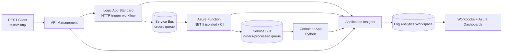

# Copilot Instructions — Azure Integration Telemetry Demo

## 1. What this repository is

A **customer-facing demo** that shows end-to-end observability across a distributed Azure
integration workload. A single message is submitted over HTTP and traverses APIM → Logic App
Standard → Service Bus → Azure Function → Service Bus → Container App. Every hop emits correlated
telemetry to Application Insights / Log Analytics so a presenter can:

1. Submit a message and watch it flow across all services.
2. Search on a **business identifier** (`OrderId`) and find every service instance that touched it.
3. Trigger a deliberate failure and instantly show which hops succeeded and exactly where it broke.

**Stretch goal:** an AI agent that answers "why did order X fail?" by querying Log Analytics.
Prefer out-of-the-box options first (Azure Monitor / Copilot in Azure, Foundry Agent Service with a
KQL tool) before building anything custom.

This is a **demo**, not production. Optimize for clarity, reproducibility, and a presenter's ability
to explain each moving part. But do not cut corners on identity — the security story is part of the demo.

## 2. Non-negotiable principles

| # | Rule |
|---|------|
| 1 | **Managed identity + RBAC everywhere it is supported.** No connection strings, no account keys, no SAS tokens, no API keys in app settings, code, or Bicep. |
| 2 | **No secrets in source control.** If a secret is truly unavoidable, document why and source it from Key Vault or `azd` environment values — never a committed file. |
| 3 | **Every app must run and debug locally, standalone.** |
| 4 | **Every app must run and debug together locally** (all services except APIM). |
| 5 | **`OrderId` (and W3C trace context) must survive every hop** and appear as a custom dimension on all telemetry. |
| 6 | **Infrastructure is Bicep. Deployment is `azd`.** Application deployment is PowerShell invoked from `azd` hooks, not `azd`'s built-in app deploy. |

## 3. Architecture



**All services share a single Application Insights resource backed by a single Log Analytics
workspace** (workspace-based App Insights). One resource makes cross-service correlation and
end-to-end transaction views work without extra effort.

### Component responsibilities

- **APIM** — front door. Validates the request, stamps/propagates correlation headers, forwards to
  the Logic App. Managed identity used for backend auth where the backend supports it.
- **Logic App Standard** — receives the HTTP request, does light enrichment, publishes to Service Bus
  using a managed-identity connection (built-in / "in-app" Service Bus connector, **not** the
  API-connection variant which needs keys).
- **Azure Function (C#, .NET 8 isolated)** — Service Bus trigger, applies business logic, publishes
  the result to the second queue. This is the hop where the **simulated failure** is injected.
- **Container App (Python)** — final consumer; logs the terminal state of the message.
- **App Insights / Log Analytics** — telemetry sink for all of the above.
- **Workbooks + Dashboards** — the visualization layer, deployed as Bicep.

## 4. Repository layout

Create directories as work requires them; keep to this shape.

```
/
├── azure.yaml                  # azd config (hooks-driven app deploy)
├── infra/
│   ├── main.bicep              # subscription- or rg-scoped entry point
│   ├── main.parameters.json    # azd-wired parameters
│   ├── abbreviations.json
│   └── modules/                # one module per service
│       ├── monitoring.bicep    # Log Analytics + App Insights
│       ├── identity.bicep      # user-assigned managed identity
│       ├── servicebus.bicep
│       ├── logicapp.bicep      # (exists)
│       ├── function.bicep
│       ├── containerapp.bicep
│       ├── apim.bicep
│       ├── rbac.bicep          # centralized role assignments
│       └── observability/      # workbook + dashboard ARM/Bicep
├── src/
│   ├── function/               # .NET 8 isolated worker
│   ├── containerapp/           # Python service + Dockerfile
│   └── logicapp/               # workflow.json + host.json + connections.json
├── apim/                       # extractor/publisher artifacts + policies
├── scripts/                    # PowerShell used by azd hooks
├── tests/
│   ├── happypath.http          # (exists)
│   └── sadpath.http            # (exists)
└── docs/
```

## 5. Technology and version choices

| Concern | Choice |
|---|---|
| IaC | Bicep (latest stable API versions; avoid preview unless required) |
| Function | C#, .NET 8, **isolated worker** model |
| Container App | Python 3.12, `azure-servicebus` + `azure-identity` |
| Logic App | Standard (single-tenant), workflows in `src/logicapp` |
| Telemetry SDK (.NET) | Azure Monitor OpenTelemetry Distro (`Azure.Monitor.OpenTelemetry.AspNetCore` / `.Exporter`) |
| Telemetry SDK (Python) | `azure-monitor-opentelemetry` |
| Auth in code | `DefaultAzureCredential` — always. Never a connection string. |
| Local HTTP testing | Huachao Mao **REST Client** VS Code extension (`.http` files in `tests/`) |
| APIM lifecycle | APIM extractor/publisher (APIOps-style) — see §10 |
| Scripting | PowerShell 7+ (`pwsh`) |

## 6. Identity and RBAC rules

- Provision **one user-assigned managed identity (UAMI)** shared by the compute services unless a
  scenario requires isolation. Assign it explicitly to Function, Logic App, Container App, and APIM.
- Grant least-privilege built-in roles. Reference role definition IDs as named `var`s with a comment
  naming the role (see the existing pattern in `infra/modules/logicapp.bicep`).

  Common roles for this demo:

  | Role | GUID | Used by |
  |---|---|---|
  | Azure Service Bus Data Sender | `69a216fc-b8fb-44d8-bc22-1f3c2cd27a39` | Logic App, Function |
  | Azure Service Bus Data Receiver | `4f6d3b9b-027b-4f4c-9142-0e5a2a2247e0` | Function, Container App |
  | Storage Blob Data Owner | `b7e6dc6d-f1e8-4753-8033-0f276bb0955b` | Function, Logic App |
  | Storage Queue Data Contributor | `974c5e8b-45b9-4653-ba55-5f855dd0fb88` | Function, Logic App |
  | Storage Table Data Contributor | `0a9a7e1f-b9d0-4cc4-a60d-0319b160aaa3` | Function, Logic App |
  | Storage File Data SMB Share Elevated Contributor | `17d1049b-9a84-46fb-8f53-869881c3d3ab` | Logic App |
  | AcrPull | `7f951dda-4ed3-4680-a7ca-43fe172d538d` | Container App |
  | Monitoring Metrics Publisher | `3913510d-42f4-4e42-8a64-420c390055eb` | all compute |

- Role assignment `name` must be a deterministic `guid(scope, principalId, roleDefinitionId)`.
- Set `principalType: 'ServicePrincipal'` on every assignment to avoid replication races.
- Disable key-based access wherever the resource supports it:
  - Service Bus: `disableLocalAuth: true`
  - Storage: `allowSharedKeyAccess: false` where the host permits it (Logic App Standard currently
    still requires shared key for its content share — if you must leave it `true`, add a comment
    explaining exactly why).
  - Web/Function/Logic apps: `basicPublishingCredentialsPolicies` for `ftp` and `scm` set to `allow: false`.
- App settings use the identity-based forms: `AzureWebJobsStorage__blobServiceUri`,
  `ServiceBusConnection__fullyQualifiedNamespace`, `*__credential: 'managedidentity'`,
  `*__clientId` / `*__managedIdentityResourceId` for the UAMI.
- The **developer** also needs data-plane roles on Service Bus and Storage so local debugging works
  through `DefaultAzureCredential` / `az login`. Grant these in Bicep to a `principalId` parameter
  that `azd` populates.

## 7. Telemetry and correlation (the heart of the demo)

### Correlation contract

Every message carries these, end to end:

| Field | Where it lives |
|---|---|
| `traceparent` | HTTP header; Service Bus **application property** `Diagnostic-Id` / `traceparent` |
| `OrderId` | JSON body property **and** Service Bus application property `OrderId` |
| `CorrelationId` | HTTP header `x-correlation-id`, defaulted by APIM if absent |

### Rules

- **Use OpenTelemetry / Azure Monitor Distro auto-instrumentation** for transport-level spans. Do not
  hand-roll dependency telemetry that the SDK already produces.
- **Add `OrderId` to every telemetry item** in a service via a telemetry processor / span processor
  (.NET) or a span processor / `logging` extra (Python) — not by manually tagging each call site.
- **Restore trace context on Service Bus receive** so the consumer span links to the producer span.
  Never let the trace break at a queue boundary.
- Emit **one explicit custom event per hop** so the demo has clean, greppable waypoints. Name them
  consistently: `OrderReceived`, `OrderQueued`, `OrderProcessed`, `OrderCompleted`, `OrderFailed`.
  Each carries `OrderId`, `Service`, and `Stage` custom dimensions.
- Exceptions must be tracked with `OrderId` attached, and must not be swallowed.
- Local runs go to the **same** App Insights resource (or a dedicated local one) — never disable
  telemetry locally, because the "debug it locally, see it in App Insights" story is part of the demo.

### Failure simulation

The sad path is driven by data, not by a redeploy. A message property (e.g.
`"simulateFailure": "downstream-timeout"`) makes the Function throw. `tests/sadpath.http` sends it.
Keep failure modes enumerated and documented in `docs/`.

### Visualizations

- **Workbook**: a message-journey view — enter an `OrderId`, get a per-hop timeline (service, stage,
  timestamp, duration, success/failure) plus the exception detail for the failing hop.
- **Dashboard**: at-a-glance volume, success rate, per-service latency, recent failures.
- Store KQL in versioned `.kql` files under `infra/modules/observability/` (or `docs/kql/`) and
  reference/embed them in the workbook Bicep so queries are reviewable in diffs.

## 8. Local development

Non-negotiable: **F5 on any single app, and F5 on everything at once (minus APIM).**

- Provide `.vscode/launch.json` with a compound configuration that starts Function + Container App +
  Logic App together, plus individual configurations for each.
- Provide `.vscode/tasks.json` for build/start prerequisites.
- Local settings files (`local.settings.json`, `.env`) are **gitignored**; commit
  `local.settings.json.sample` / `.env.sample` templates instead.
- Local config points at the **real Azure Service Bus and Storage** using the developer's identity
  via `DefaultAzureCredential` (`az login`). Do not introduce emulators unless the user asks.
- Since APIM is not run locally, `tests/*.http` must define both a local base URL and the APIM base
  URL as REST Client variables so the same file works either way.
- Document the exact local run steps in `README.md` and keep them current.

## 9. Deployment (`azd` + PowerShell hooks)

- `azure.yaml` provisions infrastructure with `azd`. **Do not** rely on `azd`'s built-in service
  deployment — several of these services are not supported. Deploy applications from PowerShell
  invoked by `azd` hooks (`postprovision`, `postdeploy`).
- All deployment scripts live in `scripts/` and must be:
  - **Idempotent** — safe to re-run.
  - **Parameterized** from `azd env get-values`, never hard-coded names or subscription IDs.
  - **Fail-fast** — `$ErrorActionPreference = 'Stop'`, check exit codes of external tools.
  - Logged clearly so a presenter can narrate what is happening.
- Bicep `output`s are the contract between infra and the deploy scripts. Output every name/URI the
  scripts need and read them via `azd env get-values`.
- Typical hook order: build/publish artifacts → deploy Function (zip) → deploy Logic App workflows
  (zip) → build & push container image → update Container App revision → publish APIM artifacts.

## 10. APIM

- APIM APIs, policies, named values, and backends are managed via the **extractor/publisher**
  (APIOps) toolchain, with artifacts committed under `apim/`.
- **Extractor** pulls the current APIM configuration into `apim/` for review and commit.
- **Publisher** applies committed artifacts to the target APIM instance, driven from a PowerShell
  `azd` hook.
- Policies must:
  - Generate `x-correlation-id` when absent and forward it downstream.
  - Preserve W3C `traceparent`.
  - Use managed identity (`authentication-managed-identity`) for backend auth, never subscription
    keys or stored credentials for backend calls.
- APIM diagnostics must be wired to the shared Application Insights resource so the gateway hop
  appears in the end-to-end transaction.

## 11. Coding conventions

**Bicep**
- One module per service under `infra/modules/`. `main.bicep` orchestrates; no inline resources of
  substance in `main.bicep`.
- `@description()` on every parameter. Use `abbreviations.json` + `resourceToken` naming.
- Apply `azd-env-name` and `azd-service-name` tags as `azd` expects.
- Prefer `existing` references over passing resource IDs around as raw strings.
- Emit outputs for everything the deploy scripts or `.http` files need.

**C# (Function)**
- .NET 8 isolated worker, nullable enabled, async all the way, DI via `Program.cs`.
- No `.Result` / `.Wait()`. No `catch { }`.
- Configuration through `IOptions<T>`; credentials only through `DefaultAzureCredential`.

**Python (Container App)**
- Python 3.12, type hints, `ruff`-clean, structured logging (no bare `print`).
- Pin dependencies in `requirements.txt`. Non-root user in the Dockerfile.

**PowerShell**
- `pwsh` (7+), approved verbs, `[CmdletBinding()]`, `param()` blocks with types.
- `$ErrorActionPreference = 'Stop'` at the top of every script.

**General**
- Comment only what needs explaining — especially any place the demo deviates from a production
  pattern, and why.
- Windows paths use backslashes; scripts should still work from a repo checked out anywhere.

## 12. Working agreements for Copilot

- **Ask before assuming** on architecture, naming, or scope decisions that are hard to reverse.
- Prefer editing existing files over creating parallel ones. `infra/modules/logicapp.bicep` is the
  reference style for module structure and role assignments.
- When adding a service, deliver the whole vertical slice: Bicep module + RBAC + telemetry
  instrumentation + local debug config + deploy script + `.http` coverage + README update.
- Before declaring work done, verify it: `az bicep build` / `azd provision --preview` for infra,
  `dotnet build` for the Function, `ruff` + import check for Python, `pwsh -NoProfile -File` syntax
  check for scripts.
- Never commit `local.settings.json`, `.env`, `*.publishsettings`, `.azure/`, or extracted APIM
  secrets.
- Keep `README.md` and `docs/` accurate — this repo gets handed to a customer.
