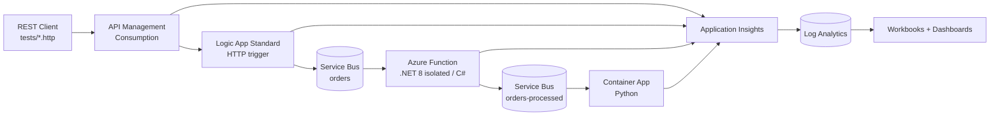

# Azure Integration Telemetry Demo

A customer-facing demo showing **end-to-end observability across a distributed Azure integration
workload**. One message is submitted over HTTP and traverses five Azure services. Every hop emits
correlated telemetry to a single Application Insights component, so you can trace a business
identifier (`OrderId`) across the whole chain — and pinpoint exactly where a failure occurred.

## The demo in three moments

1. **Flow** — submit a message from `tests/happypath.http` and watch it traverse every service.
2. **Find** — search on an `OrderId` and see every service instance that touched that message.
3. **Fail** — submit `tests/sadpath.http`, and immediately show which hops succeeded and where it broke.

## Architecture



## Status

| Area | State |
|---|---|
| Infrastructure (Bicep) | ✅ Deployed and verified in Sweden Central |
| Deployment scripts + azd hooks | ✅ Scaffolded (skip cleanly until app source exists) |
| Function app code | ⬜ Not started |
| Logic App workflows | 🟡 Empty scaffold committed at `src/logicapps/td-lg/reqres` |
| Container App code | ⬜ Not started |
| APIM APIs + policies | ⬜ Not started |
| Workbooks + dashboards | ⬜ Not started |

## Prerequisites

| Tool | Minimum | Notes |
|---|---|---|
| Azure Developer CLI (`azd`) | 1.31 | Provisions infra, holds environment values |
| Azure CLI (`az`) | 2.75 | Used by the deployment scripts |
| PowerShell (`pwsh`) | 7.0 | All hooks and scripts |
| .NET SDK | 8.0 | Function app |
| Python | 3.12 | Container App |
| Docker | 24+ | Container image build |
| VS Code + REST Client | — | Huachao Mao's extension, for `tests/*.http` |

## Provisioning

```powershell
azd auth login
azd env new telemetry-demo --location swedencentral --subscription <subscription-id>
azd provision
```

`azd provision` creates the infrastructure and then runs `scripts/deploy-all.ps1` via the
`postprovision` hook. That script deploys whichever applications exist and cleanly skips the rest,
so it works fine before any app code is written.

Teardown:

```powershell
azd down --purge
```

## What gets deployed

| Resource | Purpose | Security posture |
|---|---|---|
| Log Analytics workspace | Telemetry store | — |
| Application Insights | Shared by **all** services, workspace-based | 100% sampling (demo) |
| User-assigned managed identity | One shared principal for all compute | — |
| Service Bus namespace | `orders`, `orders-processed` queues | `disableLocalAuth: true` — no SAS keys |
| Container Registry | Python image | `adminUserEnabled: false` — Entra ID only |
| Storage (Function) | Flex Consumption backing store | `allowSharedKeyAccess: false` |
| Storage (Logic App) | Workflow runtime store | `allowSharedKeyAccess: true` — see below |
| Function App | Flex Consumption, `dotnet-isolated 8.0` | Identity-based deployment container |
| Logic App Standard | WorkflowStandard WS1 | SCM/FTP basic auth disabled |
| Container Apps env + app | Placeholder image until code exists | ACR pull via managed identity |
| API Management | Consumption SKU | System + user assigned identity |

Everything authenticates with **managed identity and RBAC**. There are no connection strings,
account keys, SAS tokens, or registry passwords in the templates or in app configuration.

### The one documented exception

Logic App Standard backs its runtime with **Azure Files**, and Azure Files does not support managed
identity. That storage account must keep `allowSharedKeyAccess: true`, and the managed identity is
granted **Storage Account Contributor** so the runtime can `listKeys` for the content share. All
*application* traffic from the Logic App (Service Bus, telemetry) still uses managed identity.

## MCAPS subscriptions

MCAPS-governed tenants assign two **Modify** policies that silently rewrite storage accounts
*after* deployment and will break this demo:

| Policy | Effect | Breaks |
|---|---|---|
| `StorageAccount_DisableLocalAuth_Modify` | Forces `allowSharedKeyAccess: false` | Logic App Standard (Azure Files) |
| `StorageAccount_PublicNetwork_Modify` | Forces `publicNetworkAccess: Disabled` | Both storage accounts — no private endpoints here |

Both honour an exemption tag, which this template applies to **only the two storage accounts**:

```bicep
tags: { SecurityControl: 'Ignore' }
```

Controlled by the `applyMcapsPolicyExemption` parameter (default `true`). Set it to `false` outside
an MCAPS tenant:

```powershell
azd env set APPLY_MCAPS_POLICY_EXEMPTION false
```

Verify the policies did not override your deployment:

```powershell
az storage account list -g rg-telemetry-demo `
  --query "[].{name:name, sharedKey:allowSharedKeyAccess, publicNet:publicNetworkAccess}" -o table
```

Expected: the Function account shows `False / Enabled`, the Logic App account `True / Enabled`.

## Environment outputs

Bicep outputs are the contract between infrastructure and the deployment scripts. Read them with:

```powershell
azd env get-values
```

Key values: `AZURE_RESOURCE_GROUP`, `AZURE_CLIENT_ID`, `SERVICE_BUS_FQDN`, `ORDERS_QUEUE_NAME`,
`FUNCTION_APP_NAME`, `LOGIC_APP_NAME`, `CONTAINER_APP_NAME`, `AZURE_CONTAINER_REGISTRY_ENDPOINT`,
`APIM_GATEWAY_URL`, `APPLICATIONINSIGHTS_CONNECTION_STRING`.

Never hard-code a resource name in a script — read it from here.

## Repository layout

```
infra/
  main.bicep              Subscription-scoped orchestration
  main.parameters.json    azd-wired parameters
  abbreviations.json      Resource naming prefixes
  modules/                One module per service
src/
  logicapps/
    logicapps.code-workspace
    td-lg/                Logic App Standard project (host.json)
      reqres/             One folder per workflow
scripts/
  common.ps1              azd env loading + helpers
  deploy-all.ps1          postprovision hook — deploys all apps
  predown.ps1             predown hook — releases APIM name
tests/
  happypath.http          Successful message flow
  sadpath.http            Simulated failure
```

## Local development

Both requirements are non-negotiable for this demo:

- **Each app runs and debugs standalone.**
- **All apps run and debug together** (everything except APIM).

Local runs authenticate to the *real* Azure Service Bus and Storage using your own identity through
`DefaultAzureCredential` — the deployment grants your principal the necessary data-plane roles. Just
run `az login`. Local settings files are gitignored; `.sample` templates are committed.

VS Code launch configurations arrive with the application code.

## Deployment model

`azd` provisions infrastructure. It does **not** deploy applications — `azure.yaml` intentionally has
no `services:` block, because azd's built-in deployment does not cover Logic App Standard workflows
or APIM API definitions. All application deployment runs through PowerShell from azd hooks.

## Conventions

See [`.github/copilot-instructions.md`](.github/copilot-instructions.md) for the full engineering
guidelines: correlation contract, telemetry rules, RBAC patterns, and per-language conventions.
